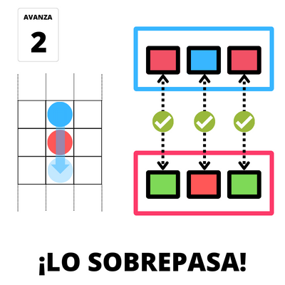

## Objetivo

El juego es una carrera, el objetivo es **cruzar la meta antes que los demás**.

{width=35%}

## Composición

* 3 tableros de camino
* 18 bloqueos
* 90 cartas
* 1 dado

\pagebreak

## Preparación

Se puede jugar de 2 o 3 jugadores.

Se sortea quien comienza, quien saca **el número más bajo inicia**.

El primero coloca **su ficha en la largada** y en orden de las agujas del reloj lo hace el resto.

{width=35%}

**Se reparten 6 bloqueos por jugador** (4 si juegan 3).

Se coloca **1 bloqueo por turno** hasta acabar con los mismos. Se pueden colocar 4 bloqueos máximos por tramo asegurando que siempre se pueda realizar al menos un paso.

{width=35%}

Se reparten **7 cartas por jugador**.

\pagebreak

## El juego

Se juega **una carta por turno** (las cartas son autoexplicativas). Estas cartas se pueden jugar para si mismos o contra un rival. 

Hay cartas de avance, de retroceso o especiales. En caso de no poder jugar ninguna carta, debe descartar una para finalizar el turno.

**Se recoge una carta**, teniendo siempre 5 cartas en mano al finalizar el turno. Si se acaban las cartas, se mezclan nuevamente.

## Avance

Se avanza tanto como es posible en horizontal o vertical, **sin repetir el casillero en el mismo movimiento**. 

{width=35%}

*Parece obvio, pero no se puede pasar a través del bloqueo.*

\pagebreak

## El sobrepaso

Cuando un jugador quiere adelantar al jugador que va primero **debe ganar el sobrepaso**. A fin de defenderse, el adelantado debe **acertar color y posición** (I, II, III) que elige atacante.

### Sobrepaso lateral
El defensor **debe acertar dos colores** en las posiciones correspondientes para no ser adelantado.

{width=35%}
{width=35%}

### Sobrepaso desde atrás
El defensor sólo **debe acertar un color** en la posicion correspondiente para no ser adelantado.

{width=35%}
{width=35%}

\pagebreak

## Finalización

Cuando el jugador **llega o cruza la meta** (no importa si se pasa), gana la carrera.

{width=35%}