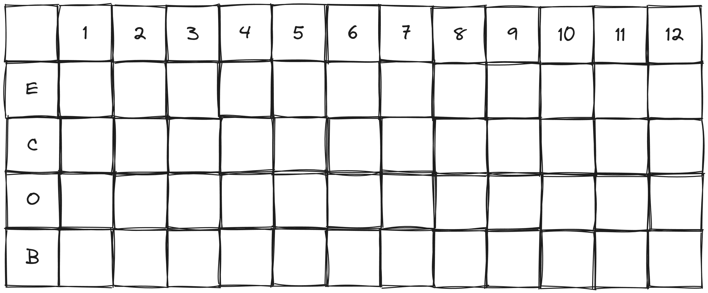

# Trichón: el reglamento

*Un juego de formar tantos tres en línea como puedas antes que se acabe el mazo.*

## Introducción

* Se necesitan **2 jugadores**.
* La duración aproximada son **15 minutos**.

### Materiales

* Un mazo de 50 cartas españolas (carta del 1 al 12 con los comodines).
* Un tablero de 12 columnas por 4 filas.
* Un lápiz para marcar el tablero (dos lápices con colores distintos mejora la experiencia).

## Preparación
* Se prepara un tablero de 12 columnas con los numeros del 1 al 12 y las 4 filas identificando: espada, copa, oro y basto.
* Se reparten 4 cartas a cada jugador.
* Se coloca el mazo boca abajo entre los dos jugadores.

## Objetivo

* El objetivo es sumar la mayor cantidad de puntos antes que se acabe el mazo.

\pagebreak

## Desarrollo

* Por cada turno se toma 1 carta del mazo y se juega 1 carta al pozo.
* Cada carta que se juega al pozo se debe marcar en el tablero.
* Si se juega 1 carta y se **forma un juego** de 3 cartas (en linea ortogonal), se marca este conjunto y se gana un punto. Estas posiciones no pueden volver a ser utilizadas otra vez para formar otro juego.
* Si un jugador tiene 2 o 3 cartas en la mano que corresponden a un mismo juego, se pueden bajar todas durante el mismo turno. *No se toman cartas adicionales del pozo por jugar más de una en un turno*.
* Solo puede completarse un juego por turno, si una carta completa más de uno a la vez, el jugador decide cual marcar.
* Al formar un juego, el rival roba 2 cartas e inicia su turno tomando una carta más por ser su turno (en total levanta 3 cartas).
* El comodín funciona como cualquier carta y esa carta reemplazada ya no podrá ser utilizada en el armado de otro juego.

{width=65%}

## Fin del juego

* El juego termina cuando un jugador no puede levantar una carta del mazo.
* El ganador es el que tiene más puntos. La partida puede quedar empatada.